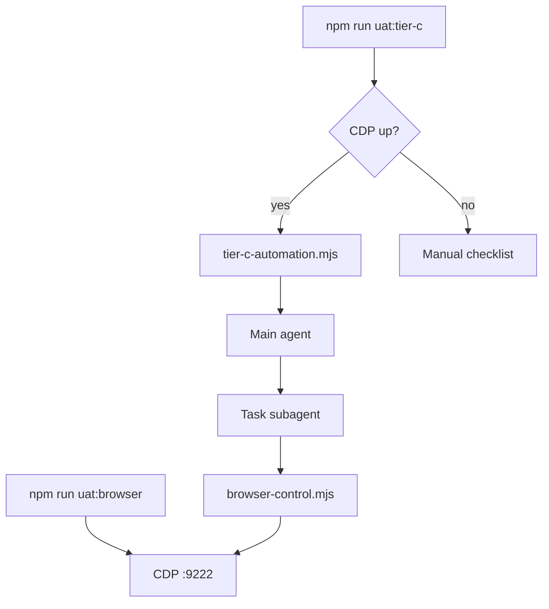

# Tier C Automation via Logged-in Browser (OpenCLI Style)

## Overview

Shift Tier C from a manual human checklist to an automated, AI-driven walkthrough. Connect to the user's browser via Chrome DevTools Protocol (CDP) using Playwright. A specialized subagent autonomously navigates the app and verifies natural-language checks from `uat-manifest.yml`.

## Architecture

**Browser profile:** `~/.uat-harness/chrome-profile` (override `UAT_CHROME_USER_DATA`). Log in once; sessions persist.

## Components

| File | Role |
|------|------|
| `scripts/browser.sh` | Launch Chrome/Edge with `--remote-debugging-port` |
| `scripts/lib/browser-control.mjs` | Playwright CDP CLI: ping, navigate, click, text, screenshot |
| `scripts/tier-c-automation.mjs` | Emit subagent dispatch prompt + flows JSON |
| `scripts/tier-c.sh` | Probe CDP; auto or manual path |

## Orchestration

1. User runs `npm run uat:browser` and `npm run dev` (or preview URL).
2. `tier-c.sh` probes `http://127.0.0.1:9222/json/version`.
3. If CDP is up, `tier-c-automation.mjs` prints instructions for the main agent to dispatch a subagent.
4. Subagent uses `browser-control.mjs` to verify each flow check; returns structured pass/fail.
5. If CDP is down, fall back to printed checklist (`--manual` skips the hint).

## Reporting

Subagent returns per-flow verdicts with evidence. Main agent writes [reference/report.md](../skills/uat-harness-skill/reference/report.md). Failed checks should include screenshot paths from `browser-control.mjs screenshot`.

## Optional dependency

Consumer projects need `playwright` or `playwright-core` as a devDependency for `browser-control.mjs`. CDP probe and manual Tier C work without it.

## Environment

| Variable | Default | Purpose |
|----------|---------|---------|
| `UAT_CDP_PORT` | `9222` | Remote debugging port |
| `UAT_CDP_URL` | `http://127.0.0.1:9222` | Full CDP base URL |
| `UAT_CHROME_USER_DATA` | `~/.uat-harness/chrome-profile` | Persistent browser profile |
| `UAT_CHROME_BIN` | auto-detect | Browser executable |
